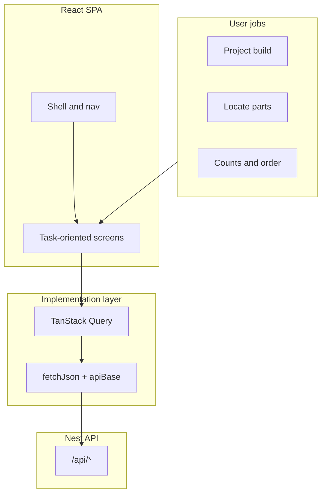

# Workbench Inventory App — Full Specification

> Intended audience: AI coding agent implementing this system in discrete, independently completable steps.
> Each phase and step is self-contained. Complete and verify one step before starting the next.
> The app is a local-network web application hosted on a Raspberry Pi, accessed via a dedicated
> kiosk touchscreen and optionally from other LAN devices (phone, laptop) via browser.

---

## Tech Stack

| Layer | Choice | Notes |
|---|---|---|
| Runtime | Node.js 24+ | LTS |
| Framework | NestJS | Modules, DI, scheduler, WebSocket, all built-in |
| ORM | TypeORM | Native NestJS integration, database-agnostic |
| Database | SQLite via `better-sqlite3` | Single file, WAL mode. Assumed for development and production target. TypeORM config abstracted so other DBs are possible without code changes |
| Frontend | React 18 + Vite + Tailwind CSS + TanStack Query | Served as static files from NestJS; workshop/kiosk UI with **light + dark** theme, bottom nav, GitHub link in shell—see **Workshop UI — frontend overhaul** below |
| Barcode input | `serialport` npm package | Scanner in USB CDC serial mode, server-side only |
| Scheduler | `@nestjs/schedule` | Cron-based backup, no OS-level cron required |
| WebSocket | `@nestjs/websockets` + `socket.io` | Scanner event broadcast to kiosk only |
| Supplier APIs | Mouser REST, TME REST | Both optional, both free with registration |
| Label printing | Brother QL via `brother_ql` Python sidecar | REST wrapper called from NestJS |

---

## Code Quality Tooling

Applied consistently across both backend (NestJS) and frontend (React). Set up in Phase 1
so all subsequent phases inherit the standards from the start.

### TypeScript
- Strict mode enabled (`"strict": true` in `tsconfig.json`)
- No implicit `any` — all types explicit or inferred from context
- Separate `tsconfig.json` per workspace (backend, frontend) with a root `tsconfig.base.json`

### ESLint
- Backend: `@typescript-eslint/eslint-plugin` + NestJS recommended rules
- Frontend: `@typescript-eslint/eslint-plugin` + `eslint-plugin-react-hooks` + `eslint-plugin-react-refresh`
- Shared base config in root `.eslintrc.base.js`, extended per workspace
- No warnings treated as errors in CI (`--max-warnings 0`)

### Prettier
- Single shared `.prettierrc` at repo root covering both workspaces
- Consistent with ESLint via `eslint-config-prettier` (disables conflicting ESLint style rules)
- Suggested config: single quotes, 2-space indent, trailing commas, 100 char print width

### Unit Testing
- Backend: Jest via `@nestjs/testing`, one spec file per service/module
- Frontend: Vitest + `@testing-library/react`; optional **pure-function** tests (e.g. `parseApiErrorMessage` in `frontend/src/api.ts`) per frontend overhaul Phase 6—no E2E or broad UI click-suite required for that initiative
- Coverage collected but no hard threshold enforced initially — coverage report generated in CI
- Priority test targets:
  - `AvailabilityService` — core derived stock calculations, all edge cases covered
  - `BOMImportService` — CSV parsing, column mapping, name matching
  - `BOMExportService` — shopping list format correctness
  - `ScannerService` — barcode buffering and terminator handling
  - `MouserService` / `TMEService` — API response parsing (mock HTTP)
  - `useCommandState` hook — full state machine transitions

### Scripts (package.json root)
```json
"lint":       "eslint . --max-warnings 0",
"format":     "prettier --write .",
"format:check": "prettier --check .",
"test":       "jest",
"test:watch": "jest --watch",
"test:cov":   "jest --coverage",
"typecheck":  "tsc --noEmit"
```

---

## Hardware Recommendations

### Touchscreen (kiosk)

Target size: 10–13". HDMI preferred for clean Pi compatibility across all Pi versions.

| Model | Size | Interface | Notes |
|---|---|---|---|
| Waveshare 10.1" HDMI LCD (B) | 10.1" | HDMI + USB touch | Good Pi support, capacitive, ~€60–80 |
| Waveshare 13.3" HDMI LCD | 13.3" | HDMI + USB touch | More comfortable for inventory browsing |
| ROADOM 10.1" HDMI | 10.1" | HDMI + USB touch | Budget option, decent reviews |
| Official Raspberry Pi Touch Display 2 | 7" | DSI | Smaller than ideal; avoid DSI on Pi 5 (pinout changed) |

Recommendation: Waveshare 10.1" or 13.3" HDMI. HDMI is universally compatible across all Pi versions.

### Label Printer

Recommendation: **Brother QL-700** (USB) or **QL-820NWB** (USB + WiFi/Ethernet).

| Model | Interface | Price (approx) | Notes |
|---|---|---|---|
| Brother QL-700 | USB | €60–70 | Reliable, well-supported on Linux via `brother_ql` |
| Brother QL-820NWB | USB + WiFi + Ethernet | €110–130 | Network printing, useful if Pi placement is awkward |

Label rolls (DK series):

| Roll | Size | Use case |
|---|---|---|
| DK-11209 | 29×62mm | Standard container/bin labels |
| DK-11201 | 29×90mm | Storage units (drawers, boxes, shelves) and project bins |
| DK-22210 | 29mm continuous | Small bins (e.g. Gridfinity 4×4cm), cut to required length |
| DK-11218 | 25mm round | Tiny parts, round labels |

Label template is configurable per container type in Settings.

### Barcode Scanner

Reference hardware: **Datalogic Heron D130** (USB, linear CCD imager).

The D130 is a **1D-only** scanner. It reads linear barcodes but not 2D symbologies (no QR codes).
All app-generated barcodes must therefore use a 1D symbology.

**Selected symbology: Code 128**
- Handles full ASCII including colons and digits (required for prefixes like `CMD:TAKE`, `BIN:00187`)
- Compact relative to Code 39
- Universally supported by all modern scanners including the D130

**Minimum label width for Code 128:** ~20–25mm for short strings at 300 DPI.
The `bin-compact` template (29mm tape, small Gridfinity bins) must prioritise barcode width;
name text is secondary and may be truncated or omitted if space is insufficient.

Serial mode configuration: scanner must be set to USB CDC mode via programming barcode in
the Datalogic manual. Default baud 9600, terminator `\r\n`.

---

## Barcode Namespaces

All barcodes are Code 128. App-generated barcodes use prefixes to identify entity type.
EAN-13/UPC-A on product packaging is also supported for items.

| Entity | Format | Example |
|---|---|---|
| StorageUnit | `SU:` + zero-padded ID | `SU:00042` |
| Container (item bin) | `BIN:` + zero-padded ID | `BIN:00187` |
| Project bin | `PBIN:` + zero-padded ID | `PBIN:00012` |
| Project | `PRJ:` + zero-padded ID | `PRJ:00007` |
| Item (packaged) | EAN-13 / UPC-A / Code 128 from packaging | `5904422366032` |
| Command codes | `CMD:` + action name | `CMD:TAKE` |
| Quantity codes | `QTY:` + number | `QTY:10` |

**EAN edge case:** same EAN across multiple containers (e.g. two partial reels of the same
capacitor value). Scan resolves to the item, then shows all container locations.

**Future — supplier delivery labels:** Mouser/TME bags carry manufacturer part numbers as
Code 128. Scanning on arrival could trigger a goods-received flow. Out of scope for initial build.

---

## Data Model

```
StorageUnit
  id              INTEGER PK
  barcode         TEXT UNIQUE       Code 128, app-generated
  name            TEXT              e.g. "Parts cabinet, drawer 3"
  parent_id       INTEGER FK → StorageUnit NULL   arbitrary nesting depth
  notes           TEXT NULL

Container
  id              INTEGER PK
  barcode         TEXT UNIQUE       Code 128, app-generated
  name            TEXT              e.g. "M3 hardware"
  storage_unit_id INTEGER FK → StorageUnit NULL
  project_id      INTEGER FK → Project NULL       set if this is a project bin
  notes           TEXT NULL

Item
  id              INTEGER PK
  name            TEXT
  description     TEXT NULL
  category_id     INTEGER FK → Category NULL
  attributes      TEXT (JSON)       key/value pairs matching category attribute definitions
  quantity        INTEGER           total physical quantity, source of truth, never auto-decremented
  min_qty         INTEGER NULL      low stock threshold
  reorder_qty     INTEGER NULL      suggested order quantity
  unit            TEXT              e.g. "pcs", "m", "g"
  barcode         TEXT UNIQUE NULL  EAN/UPC/Code128 from product packaging, optional
  container_id    INTEGER FK → Container
  notes           TEXT NULL

Category
  id              INTEGER PK
  name            TEXT
  attributes      TEXT (JSON)       array of attribute definitions (see schema below)

SupplierData
  id              INTEGER PK
  item_id         INTEGER FK → Item
  supplier        TEXT              e.g. "Mouser", "TME", "AliExpress", "LCSC"
  supplier_sku    TEXT NULL         e.g. "512-IRF540NPBF"
  url             TEXT NULL
  unit_price      REAL NULL
  currency        TEXT DEFAULT 'EUR'
  min_order_qty   INTEGER NULL
  preferred       INTEGER DEFAULT 0   boolean, one preferred per item
  notes           TEXT NULL
  last_fetched    INTEGER NULL        unix timestamp of last API fetch
  raw_data        TEXT NULL           JSON blob of full supplier API response (generic)

Project
  id              INTEGER PK
  name            TEXT
  status          TEXT              draft | active | hibernating | complete | archived
  description     TEXT NULL
  created_at      INTEGER           unix timestamp
  notes           TEXT NULL

BOMLine
  id              INTEGER PK
  project_id      INTEGER FK → Project
  item_id         INTEGER FK → Item
  quantity_required   INTEGER
  quantity_pulled     INTEGER DEFAULT 0   physically moved to project bin
  quantity_installed  INTEGER DEFAULT 0   consumed/fitted, triggers stock decrement on record
  notes           TEXT NULL
```

### Category attribute definition schema
```json
[
  { "key": "resistance", "label": "Resistance", "unit": "Ω", "type": "number" },
  { "key": "package", "label": "Package", "unit": null, "type": "enum",
    "options": ["0402","0603","0805","THT"] }
]
```
Supported attribute types: `number`, `text`, `enum`

### Derived calculations (computed at query time, never stored)

```
item.in_warehouse       = item.quantity
                          - SUM(bomline.quantity_pulled
                            WHERE project.status IN [draft, active, hibernating])

item.total_reserved     = SUM(bomline.quantity_required - bomline.quantity_installed
                            WHERE project.status IN [draft, active])

item.effectively_free   = item.in_warehouse - item.total_reserved

bomline.still_needed    = quantity_required - quantity_pulled - quantity_installed

project gap             = still_needed > 0 AND item.in_warehouse < still_needed
```

### Installed parts and stock decrement

`quantity_installed` is the only mechanism that permanently reduces `item.quantity`.
Updating it during a build is optional — it can be done incrementally or all at once.

**Project completion flow:**
When a project transitions to `complete`, the app prompts:
> "Mark all pulled parts as consumed? Stock will be reduced for X items."

On confirm: for each BOMLine, `item.quantity` decrements by `(quantity_pulled - quantity_installed)`,
`quantity_installed` is set to `quantity_required`, `quantity_pulled` zeroed.
All reservations for this project are released. No per-screw tracking required during the build.

---

## Seed Data — Default Categories

Inserted on first run if categories table is empty. User can add, edit, or delete.

| Category | Key attributes |
|---|---|
| Resistor | resistance (Ω), tolerance (%), power (W), package (enum: 0402/0603/0805/1206/THT) |
| Capacitor | capacitance (µF), voltage (V), type (enum: ceramic/electrolytic/film/tantalum), package |
| Inductor | inductance (µH), current (A), package |
| Diode | type (enum: rectifier/zener/schottky/led), voltage (V), current (A), package |
| MOSFET | channel (enum: N/P), Vds (V), Id (A), Rds (mΩ), package |
| BJT | type (enum: NPN/PNP), Vceo (V), Ic (A), package |
| Op-amp | supply_voltage (V), channels (number), package |
| IC (generic) | package (text), function (text) |
| Screw/Bolt | thread (text), length (mm), head (enum: socket/pan/countersunk/hex), material (enum: steel/stainless/nylon) |
| Nut | thread (text), type (enum: standard/nylon-insert/flange), material |
| Standoff | thread (text), length (mm), gender (enum: M-F/F-F/M-M), material |
| Connector | type (text), pins (number), pitch (mm), gender (enum: male/female/both) |
| Wire/Cable | gauge (text), type (enum: solid/stranded/coax/ribbon), color |
| PCB | width (mm), height (mm), layers (number) |
| Misc | (no defined attributes) |

---

## Supplier API Integrations

Both are optional and independently configurable. The app works fully without either —
items use manual URL and SKU entry only.

A `SupplierApiService` interface is implemented by both, making future suppliers straightforward to add.

```typescript
interface SupplierApiService {
  supplierName: string
  isConfigured(): boolean
  lookupBySKU(sku: string): Promise<SupplierLookupResult>
}
```

### Mouser
- Free API key, register at mouser.com/api
- `POST https://api.mouser.com/api/v1/search/partnumber`
- Returns: description, manufacturer, price breaks, stock, product URL, datasheet URL

### TME
- Free registration at developers.tme.eu
- HMAC-SHA1 signed requests; anonymous token sufficient for public data
- Private token optional for account-linked pricing
- Returns: description, stock, price breaks, product URL, datasheet URL
- Strong NL/EU stock and shipping — recommended as primary for EU users

### LCSC
- No reliable API (unofficial endpoints carry IP ban risk)
- Manual URL + SKU entry only

### AliExpress
- No API
- Manual URL entry only

### Batch price refresh
Sequential calls with 200ms delay to respect rate limits. Updates `raw_data` and `last_fetched`
for all items with a configured SKU, per supplier.

---

## Supplier Shopping List Export

For any project's missing/insufficient parts, or the global order list, the app can generate
a ready-to-paste shopping list for Mouser and TME.

**Mouser format** (pipe-delimited, one line per item):
```
512-IRF540NPBF|5
594-K104M15X7RF53L2|20
```
Paste into `mouser.com/tools/part-list-import.aspx` to populate a Mouser BOM/cart directly.

**TME format**: similar structure, TME SKU + quantity per line, compatible with TME's cart import.

**Behaviour:**
- Only items with a matching supplier SKU are included in that supplier's list
- Items without any matching SKU are shown separately as "needs manual sourcing"
- Quantities reflect the gap only (how many still needed, not total BOM qty)
- Presented as a copyable text area in the UI — one tap to select all, then copy to clipboard

---

## BOM Import and Export

### Import (into a project)
Accepts CSV with flexible column mapping. Minimum required columns: item name, quantity.
Optional columns: reference designators (R1, C3...), notes.

Import flow:
1. Upload CSV file
2. Server parses and attempts to match each row to an existing item by name (case-insensitive)
3. Preview shown: matched rows, unmatched rows, column mapping controls
4. User resolves unmatched rows: map to existing item, create new item, or skip
5. Confirm: BOM lines created

Supported sources: KiCad BOM export, EasyEDA BOM export, any generic CSV.

### Export (from a project)
- **Full BOM CSV**: all lines with item name, qty required, qty pulled, qty installed, still needed
- **Missing parts CSV**: only lines where `still_needed > 0`, with current stock and gap qty
- **Mouser shopping list**: pipe-delimited text for Mouser cart import (missing parts only)
- **TME shopping list**: equivalent for TME

### Order list exports
The global order list (low stock + project gaps combined) supports the same export formats.

---

## Scanner Architecture

The hardware barcode scanner is **fully optional**. The app is completely functional without
one — all flows can be driven by the touchscreen or mouse. The scanner is an efficiency layer,
not a dependency.

```
USB serial (Datalogic Heron D130, CDC mode)   ← optional hardware
  → Pi OS (/dev/ttyUSB0 or /dev/ttyACM0)
    → NestJS ScannerService (serialport)
      → WebSocket gateway (/ws/scanner)
        → kiosk browser client only
```

**Without a scanner:**
- `SCANNER_PORT` env var left empty or unset
- `ScannerService` starts in disabled state, logs info message, no error
- WebSocket gateway still starts — no events are emitted
- All screens remain fully usable via touch/mouse
- The kiosk Home screen shows a manual search bar as the primary input
- Command mode is accessible via on-screen buttons (a command palette or floating menu)
  so scanner-driven flows remain available without the physical scanner

**With a scanner:**
- `ScannerService` opens the configured serial port, reads and broadcasts events
- If port disappears at runtime: auto-reconnect loop with backoff, no crash

**The NestJS process owns the serial port exclusively.**
The browser never accesses the serial port directly.

**Client roles:**
Clients declare role on WebSocket connect: `kiosk` or `secondary`.
Only `kiosk` clients receive scanner broadcast events.
Secondary clients (phone, laptop) are completely unaffected by scanner activity.

**Future:** mobile camera barcode scanning via `zxing-js` for secondary clients. Out of scope.

---

## Scanner Command Flow

The kiosk browser runs a client-side state machine. Scanner input and touch input are fully
equivalent — either can drive or complete any action at any time.

### Command codes

Printed on desk command sheet, taped to bench. All Code 128.

| Barcode | Action |
|---|---|
| `CMD:TAKE` | Enter TAKE mode (remove from inventory) |
| `CMD:ADD` | Enter ADD mode (add stock to inventory) |
| `CMD:PULL` | Enter PULL mode (move parts to project bin) |
| `CMD:MOVE` | Enter MOVE mode (relocate a container) |
| `CMD:NEW` | Register a new container or storage unit |
| `CMD:CONFIRM` | Confirm current pending action |
| `CMD:CANCEL` | Cancel current mode, return to idle |

### Quantity codes

Printed on desk command sheet. All Code 128. Additive — scanning `QTY:10` then `QTY:5`
accumulates to 15. The running total is also editable via on-screen stepper (+/−).
Scanning `CMD:CANCEL` while accumulating resets qty to 0 without exiting the current mode.
Default quantity if no QTY code scanned: 1.

`QTY:1` `QTY:2` `QTY:3` `QTY:4` `QTY:5` `QTY:10` `QTY:20` `QTY:50` `QTY:100`

### State machine

```
IDLE
  → scan CMD:TAKE            → TAKE_AWAITING_BIN
  → scan CMD:ADD             → ADD_AWAITING_BIN
  → scan CMD:PULL            → PULL_AWAITING_PROJECT
  → scan CMD:MOVE            → MOVE_AWAITING_CONTAINER
  → scan CMD:NEW             → NEW_AWAITING_SCAN
  → scan any entity barcode  → resolve and navigate, no side effects
  → scan QTY / CMD:CONFIRM   → ignored

TAKE_AWAITING_BIN
  → scan bin barcode         → TAKE_AWAITING_QTY
                               show bin contents on screen, reset qty to 1
  → CMD:CANCEL               → IDLE

TAKE_AWAITING_QTY
  → scan QTY:n               → accumulate qty, remain in TAKE_AWAITING_QTY
  → scan CMD:CONFIRM         → execute take → TAKE_AWAITING_BIN (session continues)
  → tap confirm on screen    → same as CMD:CONFIRM
  → scan bin barcode         → IMPLEMENTATION DECISION: treat as implicit confirm of current
                               action + open new bin, OR require explicit confirm first.
                               Decide during development based on real-world feel.
  → CMD:CANCEL               → IDLE (cancels entire session)
  → inactivity timeout       → IDLE (configurable, default 30s, warn at 5s remaining)

PULL_AWAITING_PROJECT
  → scan project barcode     → PULL_AWAITING_BIN
  → CMD:CANCEL               → IDLE

PULL_AWAITING_BIN
  → scan bin barcode         → PULL_AWAITING_QTY
  → CMD:CANCEL               → IDLE

PULL_AWAITING_QTY
  → (same pattern as TAKE_AWAITING_QTY, confirms return to PULL_AWAITING_BIN)

ADD and MOVE follow analogous patterns.
```

**Multi-item session:** after a successful TAKE confirm, state returns to `TAKE_AWAITING_BIN`,
not `IDLE`. Session stays open until `CMD:CANCEL` or inactivity timeout. Allows pulling from
multiple bins without re-scanning the command code each time.

### Persistent status bar

Visible at the top of the kiosk screen whenever not in IDLE state. Hidden in IDLE.

```
┌───────────────────────────────────────────────┐
│ 📦 TAKE MODE  •  M3 hardware bin  •  Qty: 15  │
│                            [−] [+]  [✕]  [✓]  │
└───────────────────────────────────────────────┘
```

Shows: current mode, current target name (once scanned), accumulated qty, cancel and confirm.

### Command sheet

Generated from Settings as a print-optimised HTML page (browser print dialog).
All CMD and QTY codes rendered as Code 128 barcodes with human-readable labels.
Laid out for A4. App generates barcodes from its own known command code values.

---

## Warning System

Non-blocking. No action is ever refused. Warnings are modal overlays — one tap or
`CMD:CONFIRM` scan to proceed, `CMD:CANCEL` or cancel button to abort.

| Trigger | Message |
|---|---|
| Taking item with active BOM reservations | "X× [item] reserved for [Project] ([status]). Continue?" |
| Taking item with pulled BOM lines in a project bin | "X× [item] are in the project bin for [Project] ([status]). Continue?" |
| BOM pull would exceed quantity_required | "Pulling more than the BOM requires for this project. Continue?" |
| Item quantity drops below min_qty | "Stock for [item] is now below minimum ([min_qty]). Added to order list." (non-modal, toast) |
| Project has overbooked lines | Per-line indicator on project screen, no modal |
| Project completion consume prompt | "Mark all pulled parts as consumed? Stock will decrease for X items." |

---

## Workshop UI — frontend overhaul (shipped application layer)

This section records the **UX-first frontend overhaul**: cohesive workshop/kiosk UX (not generic gray admin), **task-oriented flows**, trustworthy feedback, and the **technical stack** that supports it (Tailwind, TanStack Query, SPA static hosting, Nest error parsing). It sits alongside the **scanner state machine**, **Warning System**, and **Frontend Screens** product target elsewhere in this document.

**Relationship to the rest of PLAN.md**

- **[Frontend Screens](#frontend-screens)** below describes the **full kiosk vision** (rich BOM tabs, supplier blocks on items, inventory browser, etc.).
- This section describes **what the React app in `frontend/` actually ships today** and the **phased delivery** (`progress-frontend-overhaul.md`). Where the two differ, the repo UI follows this section until the screen-level bullets below are implemented end-to-end.

### Principles (overhaul)

- **User and job first:** Screens answer concrete tasks—“what does this build still need?”, “where is this part?”, “fix count after a stock-take”, “order what’s low”—not one generic form per DTO.
- **Look and feel:** One visual language (type scale, spacing, color roles, hover/focus/disabled/loading). **Touch-friendly** targets and bottom nav suited to kiosk use. Empty and error states are **designed** (inline banners, confirmations with plain-language consequences for destructive actions).
- **Implementation serves UX:** REST + TanStack Query are plumbing; the product is the flow.

### Visual direction

Avoid a **flat gray Tailwind admin**. Prefer a **workshop-friendly** feel: breathable layout, **warm or soft neutrals**, **rounded** cards and nav (`rounded-xl` scale), subtle borders or soft shadows, generous padding on main content (`p-4`+). **Violet** accent for primary actions and active nav. Readable body size on touch (~16px equivalent for primary content). Short transitions (e.g. 150–200ms) on hover/focus/theme change where helpful. **Anti-patterns:** cramped tables with no affordance; raw unstyled tables; default controls only; walls of undifferentiated gray with no accent.

### Technical architecture



- **Styling:** **Tailwind CSS** (v4 + Vite plugin); `darkMode: 'class'` on `<html>`; **`dark:`** variants so one component tree covers light and dark.
- **Server state:** **TanStack Query** (`QueryClientProvider` in `frontend/src/main.tsx`)—caching, mutations, invalidation after actions.
- **HTTP helpers:** **`apiBase()`** (supports `VITE_API_BASE`), **`fetchJson`**, **`fetchNoContent`**; **`parseApiErrorMessage`** for Nest JSON bodies (`message` / `message[]` / `error`).
- **Production static:** Vite build output to `dist/`; Nest **`ServeStaticModule`** serves the SPA; **SPA fallback** so deep links (`/projects`, `/items`, …) return **`index.html`** (not 404); API under global prefix (e.g. `/api`).
- **Dev:** Vite dev server proxies `/api` (and scanner/socket as configured); full stack = Nest + `npm run dev --workspace frontend`; single-port deep links = production build + Nest.

### Theme, shell, and global chrome

- **Themes:** **Light** and **dark** are both first-class. User toggle in **Settings** and quick toggle in **footer** (`AppFooter`). Persistence: **`localStorage`** key **`workbench-theme`** (`light` | `dark`). First visit with no stored value: **`prefers-color-scheme`**, then persist on toggle.
- **GitHub:** Persistent link to **`https://github.com/bankersman/workbench-inventory`** in the shell (footer), **`target="_blank"`**, **`rel="noopener noreferrer"`**, accessible name (“GitHub” / “Source”).
- **Layout:** **`AppLayout`** (main content, max width), **`StatusBar`** (command mode), bottom **nav** (Home, Inventory, Projects, Order, Settings), **`CommandPalette`** (scanner-free CMD/QTY tiles). Main landmark **`id="main-content"`** for focus/skip patterns.
- **Product title:** `index.html` / app chrome use a real product name (e.g. **Workbench Inventory**).

### User journeys (overhaul anchor)

| Journey | Outcome the UI should nail |
|--------|----------------------------|
| **Project / build** | Project status, BOM vs availability, import BOM, adjust lines, export, mark complete—in context, not raw forms only. |
| **Locate stock** | Browse storage → container → item; search/filter parts by name, category, location. |
| **Correct counts** | Adjust quantity with clear before/after and container context. |
| **Reorder** | Order list screen actionable and consistent with shell (`OrderListScreen`). |
| **Admin** | Categories, backup, scanner/sidecar—same shell and plain language (`SettingsScreen`). |

### Overhaul phases (0–7) and tracker

Delivery gate after each phase: **`npm test`**, **`npm run lint`**, **`npm run typecheck`**, **`npm run format:check`**, **`npm run build`**; **CHANGELOG** entry; check off phase in **`progress-frontend-overhaul.md`**; git commit (see that file for line items).

| Phase | Scope (summary) |
|-------|-------------------|
| **0** | SPA fallback for client routes; **`fetchJson`** Nest error parsing; order list and other callers use **`apiBase()`**. |
| **1** | Tailwind + semantic layout; theme + GitHub link; TanStack Query on key lists; loading/empty/error patterns. |
| **2** | Projects list/create; project detail—BOM with availability, line CRUD, CSV import preview/confirm, exports, complete/delete. |
| **3** | Inventory hub—add storage area; storage unit edit/delete, create bin; container detail—location/project, edit/delete. |
| **4** | Parts list—search + filters; **`/items/new`** create; item detail—availability, adjust quantity (delta + reason), edit, delete; links from home/container. |
| **5** | Settings—**category** CRUD; backup/scanner/sidecar sections in same shell. |
| **6** | A11y (focus rings on nav, dialog labels); **Vitest** for **pure helpers only** (e.g. `parseApiErrorMessage`)—no E2E / click-suite mandate. |
| **7** | **Spec/doc alignment:** this **`PLAN.md`** section, **README**, **`docs/`**, **`progress.md`**, CHANGELOG coherence; **`progress-frontend-overhaul.md`** all `[x]`. |

### Client routes (shipped)

Static path **`items/new`** is registered **before** **`items/:id`** so “new” is not parsed as an id.

| Route | Screen |
|-------|--------|
| `/` | Home |
| `/inventory` | Storage units hub |
| `/storage-units/:id` | Storage unit detail |
| `/containers/:id` | Container detail |
| `/items` | Parts list (search/filters) |
| `/items/new` | Create part |
| `/items/:id` | Part detail |
| `/projects` | Projects list |
| `/projects/:id` | Project detail / BOM |
| `/order` | Order list |
| `/settings` | Settings (appearance, categories, backup, scanner, labels, command sheet) |

### Files (reference)

| Area | Examples |
|------|-----------|
| Nest static | `src/app.module.ts` (`ServeStaticModule`, `renderPath` / SPA fallback) |
| Tailwind + app shell | `frontend/vite.config.ts`, `frontend/src/main.tsx`, `frontend/src/index.css`, `frontend/src/AppLayout.tsx`, `frontend/src/components/AppFooter.tsx` |
| API + query | `frontend/src/api.ts`, `frontend/src/queryClient.ts` |
| Screens | `frontend/src/screens/*.tsx` |
| Progress | `progress-frontend-overhaul.md` (phases 0–7 checklist) |

### Risks / notes

- **500 on `/api/…`:** Backend/DB issue; clearer UI errors help distinguish from **routing** (wrong HTML vs JSON).
- **Scope:** Overhaul phases **do not** replace the full **Frontend Screens** spec in one go; they deliver a **credible shell and journeys** first, then doc alignment (Phase 7).

---

## Frontend Screens

Screens are described from the user's perspective. Implementation details (API calls, state
management) are left to the agent.

**Shipped UI today:** The section **Workshop UI — frontend overhaul (shipped application layer)** above describes the React stack, routes, and phased features actually in the repo. The subsections below remain the **full product target** for scanner flows, rich BOM UI, supplier blocks, inventory browser, and warnings—implement or trim over time.

**Interaction model:** Primary controls target **touch** (~44–48px minimum where specified). **Light and dark** themes are supported in the shipped app (not dark-only). **Scanner** and **touch** remain equivalent where the command state machine is wired. Avoid hover-only critical actions.

---

### Kiosk screens (scanner-aware)

#### Home / Scan
The default screen. Shows a prompt to scan or search.
Scanning anything navigates to the relevant detail screen.
Unknown barcodes offer to register as a new container or new item.
A search bar is always accessible as a fallback.
When a command mode is active, the status bar appears at the top and the screen
reflects the current state (e.g. "Scan a bin to take from").

#### Storage Unit Detail
Shows the unit's name and its full location path (parent chain, e.g. "Cabinet A → Drawer 3").
Lists all containers directly inside this unit with their item counts and any low-stock indicators.
Scanning any storage unit at any nesting depth arrives here directly — no tree navigation required.
Actions: edit unit details, add a container here, print label.

#### Container Detail
Shows the container's name and its storage unit location path.
Lists all items inside: name, quantity, category, low-stock flag.
If this is a project bin, shows the linked project name and status.
Actions: edit container, add item, move container (changes storage unit), print label.

#### Item Detail
Shows the item's name, category, and all category-specific attributes (e.g. resistance, package).
Shows a stock breakdown:
- Total quantity
- In warehouse (total minus what's in project bins)
- Pulled into project bins (list of which projects and how many each)
- Effectively free (in warehouse minus active reservations)

Shows all supplier data entries — each with supplier name, SKU, price if known, and a direct link.
One entry can be flagged as preferred.

Shows all projects that have this item in their BOM: how many required, pulled, installed,
and whether the project is short.

Actions: adjust quantity (shows warning if reservations are affected), edit item details,
add or edit supplier data, trigger supplier API lookup for Mouser/TME SKUs, print label.

#### Projects List
Shows all projects as cards. Each card shows: name, status badge, number of BOM lines,
number of lines with gaps, and percentage pulled.
Tap a card to open the project.

#### Project Detail
Shows project name, status, and notes.

The BOM is shown as a table. Each row shows:
- Item name (tappable, navigates to item detail)
- Required quantity
- Quantity pulled to project bin
- Quantity installed
- Still needed
- Current warehouse stock
- A status icon: ✓ fully pulled / ○ reserved but not yet pulled / ⚠ short / ✗ missing entirely / 📦 stock exists but in another project's bin (borrowable)

Three tabs filter the view: All / Missing / Borrowable.

Actions available on this screen:
- Add a BOM line (search for item, enter quantity)
- Import BOM from CSV (upload → preview/map columns → confirm)
- Export full BOM as CSV
- Export missing parts as CSV
- Generate Mouser shopping list (shows copyable text, lists unmatched items separately)
- Generate TME shopping list (same)
- Pull parts: select a BOM line, enter quantity, confirm (warning shown if borrowing)
- Mark parts as installed: select a BOM line, enter quantity installed
- Change project status
- Complete project (triggers bulk consume prompt)

#### Order List
Two sections: **Low Stock** (items below min_qty) and **Project Gaps** (items insufficient
for one or more active/draft projects). Items can appear in both.

Each row shows: item name, current stock, minimum qty or gap size, suggested reorder quantity,
preferred supplier name and link, last fetched price and when it was fetched.

Actions:
- Refresh prices (re-fetches all Mouser/TME SKUs, shows progress)
- Export order list as CSV
- Generate Mouser shopping list for all order list items
- Generate TME shopping list for all order list items
- Tap any item to navigate to its detail screen

#### Inventory Browser

> **Shipped UI (overhaul):** A **Parts** flow exists at **`/items`** with text search and filters (category, storage unit, container)—see route table in **Workshop UI — frontend overhaul**. Attribute-based filters below are API-capable but not necessarily exposed in the current UI.

A searchable, filterable view of all items.
Filter by: free text search, category, storage unit / location, low stock only.
When a category is selected, its specific attributes become filterable
(e.g. filter Resistors by package: 0603).
Each row shows item name, container name, location path, quantity, and stock status.
Tap any row to navigate to item detail.

#### Settings

> **Shipped UI (overhaul):** **Categories** supports list + create + rename + delete by **name** in the same shell as the rest of the app. **Appearance** (light/dark), **backup** (run + download), **scanner** and **sidecar** status, **command sheet** link, and supplier keys as environment copy are present with the shared layout. Full **category attribute-definition** editing (below) may still be future work in the UI.

Organised into sections:

**Categories** — list of all categories. Add new, edit name and attribute definitions,
delete if no items use it. The attribute editor allows adding/removing/reordering fields,
setting type (number/text/enum) and unit.

**Scanner** — configure serial port path and baud rate. Shows current connection status.
Button to test connection (triggers a beep or indicator).

**Suppliers** — enter Mouser API key and TME app key/secret. Shows which suppliers are
currently configured. Buttons to test each connection.

**Backup** — shows timestamp of last backup and list of recent backup files.
Button to trigger a backup now. Button to download the current database file.

**Labels** — configure default label template per container type. Button to print a test label.

**Command sheet** — button to open the print view for the desk command reference sheet.

---

### Second screen (phone, laptop — touch/mouse only)

All screens above are fully accessible. No scanner events are received, no command mode,
no status bar. Navigation is purely touch/mouse.
The layout adapts to smaller viewports (phone-sized).
Camera barcode scanning is noted as a future feature for this client type.

---

## Label Printing

### Architecture

```
NestJS LabelService  →  BrotherQLService (HTTP)  →  Python sidecar (Flask :5050)  →  Brother QL
```

Labels are generated as PNG images server-side using the `canvas` npm package.
Code 128 barcodes are rendered using the `bwip-js` npm package.
The PNG is sent to the Python sidecar which forwards to `brother_ql`.

### Label templates

| Template | Roll | Approx size | Content |
|---|---|---|---|
| `bin-standard` | DK-11209 | 29×62mm | Container name, storage unit path, Code 128 barcode |
| `bin-compact` | DK-22210 | 29×~20mm | Short name (may truncate), Code 128 barcode (priority) |
| `storage-unit` | DK-11201 | 29×90mm | Unit name, parent path, Code 128 barcode, container count |
| `project-bin` | DK-11209 | 29×62mm | Project name, status, Code 128 barcode |
| `command-sheet` | A4 (browser print) | — | All CMD + QTY codes as Code 128 grid with labels |

Default template per container type is configurable in Settings.
`bin-compact` prioritises barcode width — Code 128 minimum ~20–25mm at 300 DPI.

---

## Backup

Handled by NestJS scheduler — no OS-level cron needed.

```typescript
@Cron('0 2 * * *')  // nightly at 2am
async scheduledBackup() { ... }
```

Steps: copy `inventory.db` to `backups/inventory_YYYYMMDD.db` → prune files older than
30 days → rsync to NAS if `NAS_PATH` env var is set → update `last_backup` in settings table.

Manual trigger and file download available from the Settings screen and via API.

---

## Project Structure

```
/opt/inventory/
  .env
  package.json
  dist/
  src/
    main.ts
    app.module.ts
    database/
      database.module.ts        TypeORM SQLite config, WAL mode enabled
      entities/                 one TypeORM entity class per data model entity
      migrations/
      seed.ts                   default categories on first run
    modules/
      scanner/
        scanner.service.ts      serialport reader, emits barcode events internally
        scanner.gateway.ts      WebSocket gateway, kiosk-only broadcast
      storage-units/
      containers/
      items/
      categories/
      projects/
      bom/
        bom.service.ts
        bom-import.service.ts   CSV parse, match, preview, confirm
        bom-export.service.ts   CSV export, shopping list generation
      order-list/
        order-list.service.ts
        order-list-export.service.ts
      suppliers/
        supplier-api.interface.ts
        mouser.service.ts
        tme.service.ts
      labels/
        label.service.ts        PNG generation (canvas + bwip-js)
        brother-ql.service.ts   HTTP client to Python sidecar
      backup/
        backup.service.ts
        backup.scheduler.ts
      availability/
        availability.service.ts   all derived stock calculations — unit tested
    frontend/
      src/
        App.tsx
        hooks/
          useScanner.ts           WebSocket, kiosk role, exposes scan events
          useCommandState.ts      full state machine
          useWarning.ts           warning dialog state
        screens/
          Home.tsx
          StorageUnitDetail.tsx
          ContainerDetail.tsx
          ItemDetail.tsx
          ProjectList.tsx
          ProjectDetail.tsx
          OrderList.tsx
          InventoryBrowser.tsx
          Settings.tsx
        components/
          StatusBar.tsx           command mode bar, hidden in IDLE
          WarningDialog.tsx
          BOMTable.tsx
          StockBreakdown.tsx
          SupplierList.tsx
          AttributeFields.tsx
          StepperInput.tsx
          LabelPreview.tsx
          ShoppingListExport.tsx  copyable text area + unmatched items list
          CopyButton.tsx
  data/
    inventory.db
  backups/
  label-sidecar/
    sidecar.py
    requirements.txt            brother_ql, flask, bwip-py (Code 128 fallback if needed)
```

---

## Environment Variables

```
PORT=3000
DB_PATH=/opt/inventory/data/inventory.db
SCANNER_PORT=/dev/ttyUSB0
SCANNER_BAUD=9600
MOUSER_API_KEY=
TME_APP_KEY=
TME_APP_SECRET=
NAS_PATH=                       # optional, e.g. user@nas:/volume1/backups/inventory
LABEL_SIDECAR_URL=http://localhost:5050
```

---

## Build Phases

Each phase is independently completable and leaves the app in a working state.

---

### Phase 1 — Foundation
**Goal:** NestJS running, SQLite connected via TypeORM, schema migrated, seed data loaded,
health check responding, all code quality tooling configured and passing.

#### Step 1.1 — Project scaffold and tooling
- Initialise NestJS project with TypeScript
- Install core dependencies: `@nestjs/typeorm`, `typeorm`, `better-sqlite3`, `@nestjs/websockets`,
  `socket.io`, `@nestjs/schedule`, `serialport`, `canvas`, `bwip-js`, `dotenv`
- Install dev dependencies: `eslint`, `@typescript-eslint/eslint-plugin`, `prettier`,
  `eslint-config-prettier`, `jest`, `@nestjs/testing`, `vitest`, `@testing-library/react`
- Configure strict TypeScript (`tsconfig.base.json` + per-workspace configs)
- Configure ESLint (shared base config + per-workspace extends)
- Configure Prettier (shared `.prettierrc` at repo root)
- Add all scripts to root `package.json`: `lint`, `format`, `format:check`, `test`, `test:cov`, `typecheck`
- Configure TypeORM for SQLite; enable WAL mode; path from `DB_PATH` env var
- Configure Vite React frontend as subfolder; NestJS serves `dist/frontend` as static
- Verify: `lint`, `typecheck`, and `test` all pass on the empty project

#### Step 1.2 — Entities and migration
- TypeORM entity classes for all entities in the data model
- Generate and run initial migration
- Seed service: insert default categories on bootstrap if table is empty

#### Step 1.3 — Verify
- `GET /api/health` → `{ ok: true, version: string }`
- Server starts, DB migrated, seed data present, endpoint responds
- `lint`, `typecheck`, `test` still all pass

---

### Phase 2 — Core Inventory CRUD
**Goal:** Full create/read/update/delete for storage units, containers, items, categories.
Unified barcode scan resolution working.

#### Step 2.1 — Storage unit module
- CRUD endpoints for storage units
- Detail response includes direct children (containers in this unit)
- Guard against circular parent references on update

#### Step 2.2 — Container module
- CRUD endpoints for containers
- Storage unit and project relations included in responses

#### Step 2.3 — Item module
- CRUD endpoints for items
- List endpoint supports filters: free text, category, container, storage unit,
  JSON attribute queries (e.g. `?attr[package]=0603`)
- Quantity adjustment endpoint: delta + reason

#### Step 2.4 — Category module
- CRUD endpoints for categories
- Validate attribute definition JSON shape on write

#### Step 2.5 — Unified scan resolution
- Single endpoint resolves any scanned value to entity type + entity, or unknown
- Handles all barcode namespaces and EAN on product packaging

#### Step 2.6 — Availability service
- `getItemAvailability(itemId)`: returns all derived stock fields
- `getProjectAvailability(projectId)`: per-line availability for a project
- Unit test this service thoroughly — it is the core business logic

---

### Phase 3 — Scanner Integration
**Goal:** Hardware scanner optional but fully integrated when present. WebSocket gateway
running regardless, kiosk command mode accessible without scanner via on-screen UI.

#### Step 3.1 — Serial port service
- Check `SCANNER_PORT` env var on bootstrap; if empty or unset, start in disabled state and log info
- When enabled: open port, buffer bytes, emit on `\r\n` or `\r` terminator
- Auto-reconnect with backoff if port disappears at runtime
- Expose `isEnabled(): boolean` and `isConnected(): boolean` for health/settings use

#### Step 3.2 — WebSocket gateway
- Clients declare `role: 'kiosk' | 'secondary'` on connect
- Barcode events broadcast only to kiosk clients
- Also broadcasts `{ type: 'scanner_status', connected: boolean }` on connect/disconnect
- Ping/pong keepalive

#### Step 3.3 — On-screen command palette (scanner-free fallback)
- A floating action button or command bar visible on the kiosk Home screen when no scanner
  event has been received recently (or always, configurable in Settings)
- Tapping it opens a grid of command mode buttons matching the physical command sheet:
  TAKE, ADD, PULL, MOVE, NEW, plus quantity buttons
- Allows full scanner command flow via touch only
- Ensures the app is fully usable without physical scanner hardware

---

### Phase 4 — Frontend Core
**Goal:** React kiosk app, scanner state machine, core navigation and screens working.

#### Step 4.1 — App shell
- Vite + React + **Tailwind CSS** + **light/dark** theme (class on root, user toggle + persistence—see **Workshop UI — frontend overhaul**); touch-friendly targets (~44–48px primary controls)
- Bottom navigation: Home, Inventory, Projects, Order, Settings; shell includes **GitHub** link and optional **AppFooter** theme toggle
- **TanStack Query** for server state on task screens; **`apiBase()`** / **`fetchJson`** for API calls

#### Step 4.2 — Scanner hook and state machine
- `useScanner`: WebSocket with `role: kiosk`, exposes latest scan event
- `useCommandState`: full state machine per this spec
- Touch and scanner inputs both dispatch to same state

#### Step 4.3 — Status bar
- Rendered persistently, visible only outside IDLE
- Mode, target, qty, stepper, cancel, confirm

#### Step 4.4 — Home screen
#### Step 4.5 — Storage unit detail screen
#### Step 4.6 — Container detail screen
#### Step 4.7 — Item detail screen
- Stock breakdown, supplier list, quantity adjustment with warning flow

---

### Phase 5 — Projects and BOM
**Goal:** Full project lifecycle with BOM, availability indicators, pull and install tracking,
CSV import and export, shopping list generation.

#### Step 5.1 — Project module
- CRUD for projects including status transitions
- Project completion endpoint (bulk consume flow)

#### Step 5.2 — BOM module
- BOM line CRUD
- Pull and install adjustment endpoints
- Per-line availability from availability service

#### Step 5.3 — BOM import
- CSV parse, column detection and flexible mapping
- Name-match to existing items (case-insensitive)
- Preview response: matched + unmatched rows
- Confirm endpoint applies the import

#### Step 5.4 — BOM and order list export
- Full BOM CSV
- Missing parts CSV
- Mouser shopping list: pipe-delimited `SKU|qty`, missing items flagged separately
- TME shopping list: equivalent format
- Shared export logic usable from both project detail and global order list

#### Step 5.5 — Projects list screen
#### Step 5.6 — Project detail screen
- BOM table with tabs, status icons, pull flow, install tracking
- CSV import flow (upload → preview → confirm)
- All export/shopping list actions with `ShoppingListExport` component
- Project completion action

---

### Phase 6 — Order List and Supplier APIs
**Goal:** Global order list with live supplier data, batch refresh, all export formats.

#### Step 6.1 — Order list module
- Query: items where `quantity < min_qty` OR project gap exists
- Returns reason(s), suggested qty, preferred supplier data per item

#### Step 6.2 — Mouser service
- Implements `SupplierApiService` interface
- Lookup by SKU, store result in `SupplierData.raw_data`, update `last_fetched`

#### Step 6.3 — TME service
- Implements `SupplierApiService` interface
- HMAC-SHA1 request signing

#### Step 6.4 — Batch refresh
- Loops all items with Mouser/TME SKUs, sequential with 200ms delay

#### Step 6.5 — Order list screen
- Two sections, per-item supplier links and prices
- Refresh prices, export CSV, Mouser shopping list, TME shopping list

---

### Phase 7 — Label Printing
**Goal:** Generate and print Code 128 labels for all scannable entities.

#### Step 7.1 — Python sidecar
- Flask app on port 5050: `POST /print` (PNG + config), `GET /status`
- `requirements.txt`: `brother_ql`, `flask`

#### Step 7.2 — Label service
- PNG generation per template using `canvas`
- Code 128 barcode rendering using `bwip-js`
- All templates defined in this spec
- `BrotherQLService` HTTP client to sidecar

#### Step 7.3 — Label and command sheet endpoints

#### Step 7.4 — Label UI
- Print button on container, storage unit, and project detail screens
- Template selector, PNG preview before sending to printer

---

### Phase 8 — Backup
**Goal:** Nightly scheduled backup and manual controls.

#### Step 8.1 — Backup service
- Copy DB, prune old files, optional rsync to NAS via `child_process`
- Store `last_backup` timestamp in a `settings` key-value table

#### Step 8.2 — Scheduler
- `@Cron('0 2 * * *')` calling backup service

#### Step 8.3 — Backup endpoints and Settings UI section

---

### Phase 9 — Settings, Polish, Resilience
**Goal:** Complete settings screen, all warnings wired, production-stable on Pi.

#### Step 9.1 — Settings screen
- All sections: categories, scanner, suppliers, backup, labels, command sheet

#### Step 9.2 — Warning system
- `useWarning` hook and `WarningDialog`
- All warning triggers from the warning table wired with full project context visible

#### Step 9.3 — Inactivity timeout
- Configurable (default 30s), resets command state to IDLE
- 5s countdown toast before reset fires

#### Step 9.4 — Resilience
- Serial port auto-reconnect
- WebSocket auto-reconnect in `useScanner` hook
- Graceful API error handling (no white screen on failure)
- Offline supplier handling: show cached data, disable refresh when unreachable
- SQLite WAL + busy timeout for concurrent LAN clients

#### Step 9.5 — Second screen QA
- Verify no scanner events reach secondary clients
- All screens usable touch/mouse only
- Responsive layout for phone viewport

---

### Phase 10 — CI/CD and Docker
**Goal:** GitHub Actions pipeline running quality checks on every PR and push.
Docker image built and published on release. App runnable via Docker Compose for
anyone without a Pi or local Node setup.

#### Step 10.1 — GitHub Actions: CI pipeline
Trigger: push to any branch, pull request to `main`.

Jobs:
1. **lint** — `npm run lint`
2. **typecheck** — `npm run typecheck`
3. **test** — `npm run test:cov`, upload coverage report as artifact
4. **build** — `npm run build` (NestJS + Vite), verify output exists

All jobs run in parallel where possible. PR merge blocked if any job fails.

#### Step 10.2 — GitHub Actions: Docker build and publish
Trigger: push of a version tag (`v*.*.*`) or manual workflow dispatch.

Jobs:
1. Build multi-arch Docker image (`linux/amd64`, `linux/arm64` for Pi)
2. Push to GitHub Container Registry (`ghcr.io`)
3. Tag as both `v1.2.3` and `latest`
4. Second image for the label sidecar: `ghcr.io/owner/workbench-inventory-label-sidecar` (same tags)

The **label sidecar** is a **separate** distroless Python image (`label-sidecar/Dockerfile`). The main app image is distroless Node only (`gcr.io/distroless/nodejs24-debian12:nonroot`); native Node addons bundle their shared libraries at build time.

#### Step 10.3 — Docker Compose
`docker-compose.yml` at repo root for local development and target deployment:

```yaml
services:
  app:
    image: ghcr.io/owner/workbench-inventory:latest
    depends_on:
      - label-sidecar
    ports:
      - "3000:3000"
    environment:
      LABEL_SIDECAR_URL: http://label-sidecar:5050
    volumes:
      - ./data:/opt/inventory/data
      - ./backups:/opt/inventory/backups
    devices:
      - /dev/ttyUSB0:/dev/ttyUSB0   # optional, scanner passthrough
    env_file: .env
  label-sidecar:
    image: ghcr.io/owner/workbench-inventory-label-sidecar:latest
    ports:
      - "5050:5050"
```

Volume mounts keep the database and backups outside the container.
Scanner device passthrough is optional — omit the `devices` section if no scanner.

#### Step 10.4 — Dockerfile
- **App** (`Dockerfile`): multi-stage build (Node 24 Bookworm) → runtime `gcr.io/distroless/nodejs24-debian12:nonroot`; copy extra `.so` for `canvas` / `better-sqlite3`; health check via Node `fetch` to `/api/health`
- **Sidecar** (`label-sidecar/Dockerfile`): pip install in build stage → `gcr.io/distroless/python3-debian12:nonroot`
- Non-root (`65532`) in both runtimes

---

### Phase 11 — Documentation and Community
**Goal:** GitHub Pages site with user-facing manual and project info.
Contribution guide for open source contributors.

#### Step 11.1 — GitHub Pages site
Built with a static site generator (suggested: VitePress — consistent with the Vite
frontend toolchain already in use). Deployed automatically on push to `main` via
GitHub Actions.

Sections:
- **What is this?** — project overview, screenshots, feature summary
- **Getting started** — Docker Compose quickstart (recommended), manual install
- **Hardware** — touchscreen recommendations, label printer setup, scanner setup,
  note that all hardware is optional
- **Configuration** — environment variables reference
- **Usage guide** — screens walkthrough, scanner command flow, BOM import/export,
  label printing, backup
- **Development** — local setup, project structure, running tests

#### Step 11.2 — Contribution guide (`CONTRIBUTING.md`)
- How to set up the development environment
- Branch naming and commit message conventions
- PR process: what reviewers look for, required checks
- How to add a new supplier API integration (the interface to implement)
- How to add a new label template
- How to add a new default category
- Code style notes (ESLint + Prettier enforce most of it automatically)
- Running the test suite, writing new tests

#### Step 11.3 — Supporting repo files
- `README.md`: brief intro, quickstart (Docker Compose in 3 commands), link to full docs
- `LICENSE`: choose at project start (MIT suggested for maximum openness)
- `.github/ISSUE_TEMPLATE/`: bug report and feature request templates
- `.github/pull_request_template.md`: checklist (tests pass, types checked, docs updated)
- `CHANGELOG.md`: maintained manually or via conventional commits tooling

---

## Out of Scope (future)

- OS setup, kiosk browser configuration, multi-app workbench launcher
- Mobile camera barcode scanning via `zxing-js`
- Supplier delivery label scanning for goods-received flow
- Multi-user authentication
- Cloud backup beyond LAN rsync
